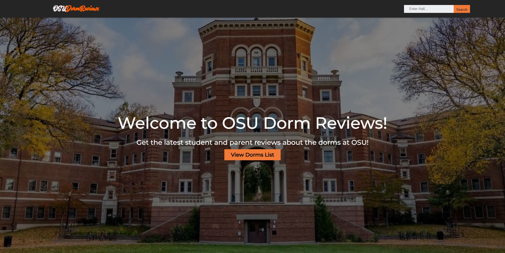

<h1 align="center">OSU-Dorm-Review-Site</h1>

<h3 align="center">The site is no longer deployed :(</a></h3>
<h3 align="center">Preview images coming soon</a></h3>

<h3 align="center">This app was created for the Spring 2023 OSU Hackathon. This is a solo project where I leveraged AI tools such as GitHub Copilot and ChatGPT to create a dorm review site for Oregon State University. The project placed third overall and recieved $50 dollars in earnings.</h4>

<h2 align="center">Technologies Used</h2>

<h3 align="center">Python, Flask, HTML, CSS, and JavaScript.</h3>
